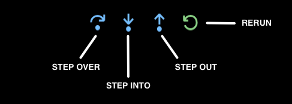
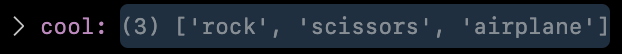
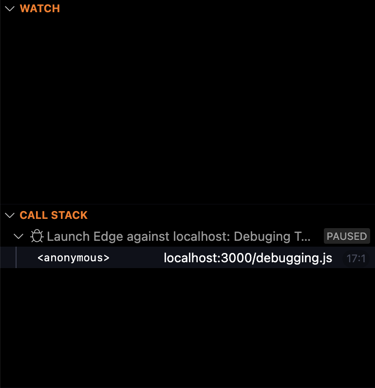

# The Art of Debugging Websites

_Aside: For this article, I am going to be using JavaScript and VS Code for the examples, but as this article is more of a why and not a how-to, any editor and language should be applicable._

For eons, javascript developers have been printing their code values to either the screen or the console to find the value of a variable, function, or array, in your code. This exchange generally looks like something below:


```
console.log(variable)
```


What if though, you could do this exchange in your code editor instead and skip the browser? What if you could look at more complicated code and see all the variables in a file at once while you run it? 


## Welcome to the Art of Debugging.

While I could go into detail on how the debugger works from beginning to end, that is not what I am going for here. Many other articles and video tutorials cover the process of debugging, including one from the VS Code team, instead in this article, I am going rather into the why of debugging and why it is preferable to logging out commands onto the browser's console.


## Debug on

What makes debugging such a powerful part of any developer's arsenal? The answer is that can show you how your code is being run in real time. No guessing, no taking a shot in the dark, just feedback on how your code is performing. So, for instance, if you wrote a variable like `let cool = []` and then added some values such as `[rocks, paper, scissors]`, but what if down along the way there was some array push and splices, and now cool is equal to `['rock', 'scissors']` but also now includes `['airplanes', 'sailboats', 'cars', 'trains']`?

I know this example seems a bit simplistic but if you were to simply `console.log(cool)` it would come up with a final result and would not show the steps leading to the problem. This is why debugging is helpful as it takes you through the entire process, step by step, from where you place your first breakpoint, to its ultimate end in the application. This process can help clear up what caused the problem and the steps to fix to problem.



## Stepping up

In debugging there are three main controls in most IDEs: step into, step out, and step over. Along with continue and stop this makes up the crux of the debugging arsenal. When you set something known as a breakpoint and start the debugging process, the editor will pause where you set the breakpoint. At this point, you can start doing a few different things to understand what is happening with your code.

The step-over command is what I use the most often as it allows you to go through, line by line, and see what is exactly being run inside your code. When you do this you will see that the variables panel light up with the current set of variables and what the current values are as you run through them.



The Step Out and Step Into are similar and not something I use a lot on a day-to-day basis but can be useful. They can, as the name implies, allow you to step into and out of various functions within your code. This can be especially useful when encountering loops and wanting to move to the next piece of code.

Using these three commands you can generally get to and inspect any piece of code faster and more accurately than printing a bunch of values to the browser's console tab.

## Watching you

Finally, I want to mention two other tabs in the VS Code inspector are helpful, but I do not use them very often, and truth be told I normally have closed. These tabs are the Watch and Call Stack. Now the Call Stack is a bit more advanced than I want to get into in this post, but the Watch is really interesting.

What the watch does is allow you to write in a variable as an expression and you can watch as the values will change throughout the application's run time. This is useful if you want to see how one variable will change throughout a program's lifecycle.



## Wrap up

Hopefully, this gives you some idea of why debugging is super powerful and why you should use it in your next project. Some resources to get you started on this journey are the [VS Code official documentation](https://code.visualstudio.com/Docs/editor/debugging), [TechTims video overview of debugging](https://youtu.be/7qZBwhSlfOo), or just trying it out and see how it goes.

I hope this is useful and I hope to level up your coding game.
