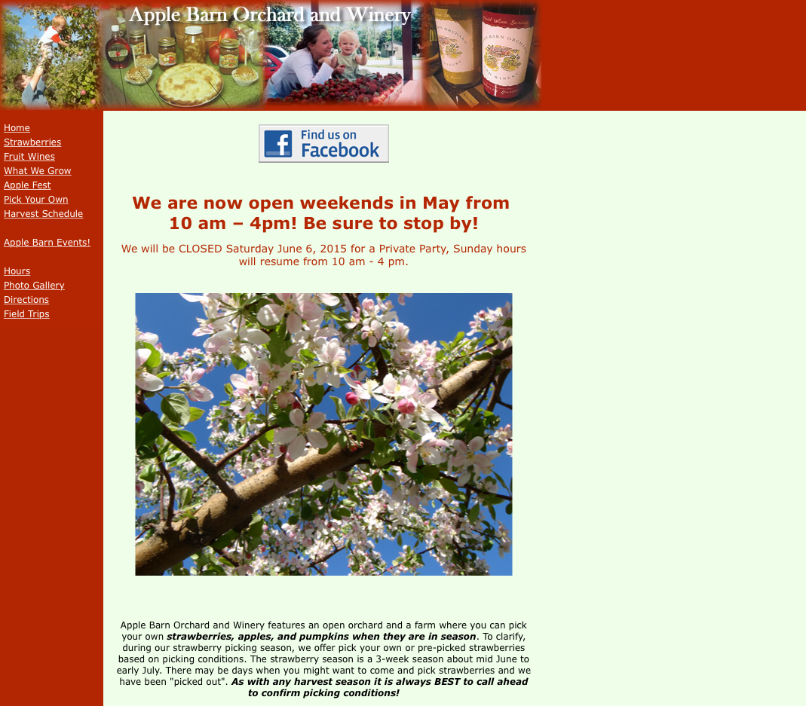
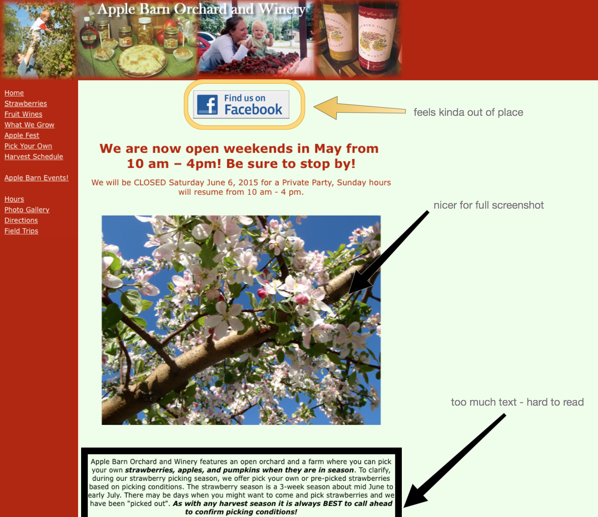
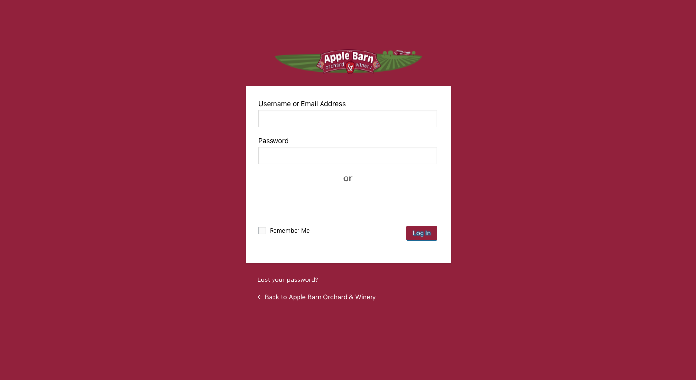

## Overview

Apple Barn is a family-owned farm located in Elkhorn, Wisconsin. They specialize in fresh Strawberries, Pumpkins, many different varieties of Apples, and wine. Families of all kinds can come to the farm and expect a fun experience of picking up the freshest fruit and sample great wine at the winery.

## The Project

The team came to me, through a mutual friend, and wanted to refresh their current website. The old website was build with static markup and was extreamly outdated. The final website had to be done in Wordpress and use a pre-built theme due to a quick turnaround for the next season.

## Research

Working with the team, I built a competitive analysis, which is a document that compares their website with four of their closest competitors. I used certain pages of each competitor and commentated on them with my suggestions or notes for each page.  Finally, I used this document to find the companies strengths and used this to help find them a theme.

## Selection

Looking throughout a variety of themes, I found six themes to send with the team for selection. After a week, the team came back with the [Non-Profit theme](https://organicthemes.com/theme/non-profit-theme/) as their choice, which we bought and started using.

## Design and Development

After installing the theme, I provided the team with many other tasks, including:

- A Custom Login Page
- Custom PHP and CSS Overrides
- Region Management

### Custom Login

As an extension of the Apple Barn brand, it was important that the back-end felt like part of the Apple Barn website. For this, I created several different branding cues for the back-end, including a custom themed login page, custom widgets on the dashboard screens and a custom coloring on the sidebars as well. These changes was important to keep a visual identity throughout and help newer members feel part of the team.

### Custom PHP and CSS overrides

Using my extensive knowledge of PHP and CSS I was able to assist the team in further customizing the web page. This included:

- Changing widths and heights of certain items.
- Simplifying certain Wordpress properties and elements.
- Added new custom elements to the website.

### Region Management

The main strength of Wordpress for the team is the ease of content flow and use of creating and editing content. To help with this, I worked with the team to create new sections of the theme were new content could get added or changed. This was helpful as it allowed the team to edit and maintain a stream of content throughout their seasons of growth.

## Wrap Up and Deploying

After receiving final website approval, I worked with the team to deploy the website. Following up I created documentation and videos to help the team use their new website maintain it well in the future.
