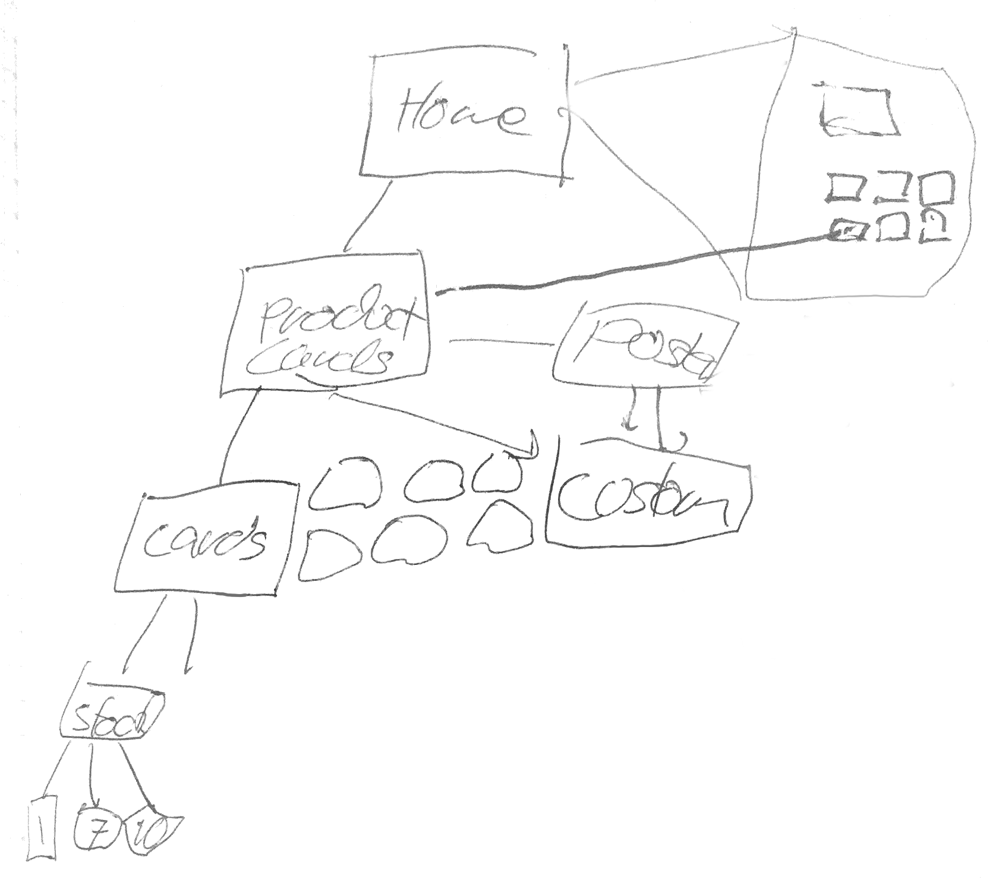
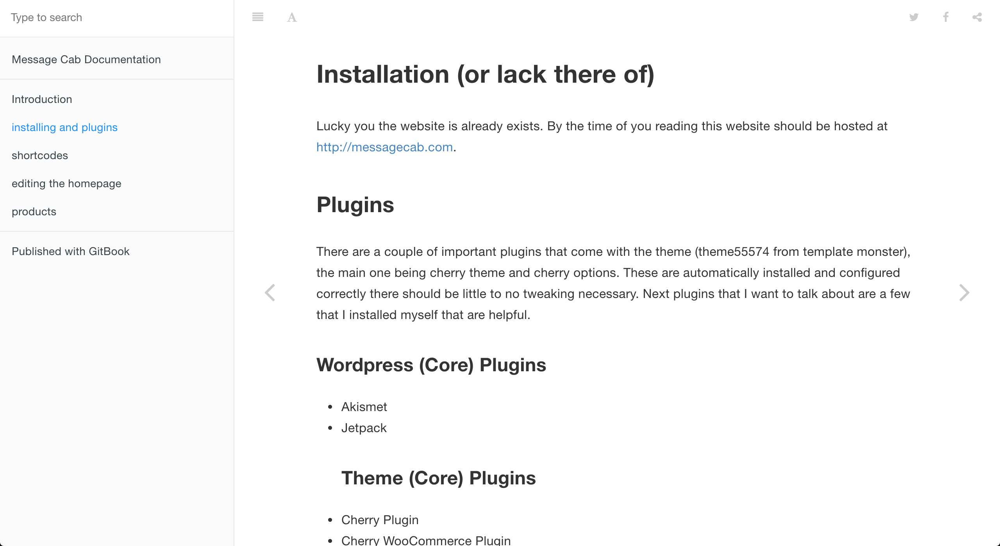

## Overview

Selling cards and posters were the dream for a client of mine as a side business. The client had the idea for the website and the inventory to sell. He needed my technical skills to reach a global audience with his product.

## Collaboration

Listening to the client, I started giving advice based on my many years of experience. This advice included things like the best shopping solution for the website. For this I suggested FoxyCart but we ended with WooCommerce since it came with the theme. The next topic was the best way to host the website. I recommended SiteGround, but the client had another solution in mind. Finally, we spoke of the experience of shopping, I gave my past experiences and we created a flow from there.

## Development

From this state, I started sketching out the initial map of the website. Going from a theme that the client picked out and bought, we started to develop a shared language for the site. We chose which product was to be featured, how they are categorized, and the quantity of them.

From there I started working on the website itself. I used Wordpress as the backend so the client would be comfortable viewing inventory. I modified stock WordPress elements to give the website a unique feel to the product. I also deleted many unneeded and unused elements as they weren't needed taking up space.

## Documentation and Wrap Up

Once all the modifications and setup was complete. I took two weeks to build a user manual for the client, using Git Books. This manual went over backend operations, the visual styles used, and core operations. A part of this manual was also written for future developers. This was in case there was an problem I was unavailable to assist with.

This website was unable to stay alive for long due to limited stock and hosting problems. I have spoken to the client many times of a stronger solution and a solution in the future.
