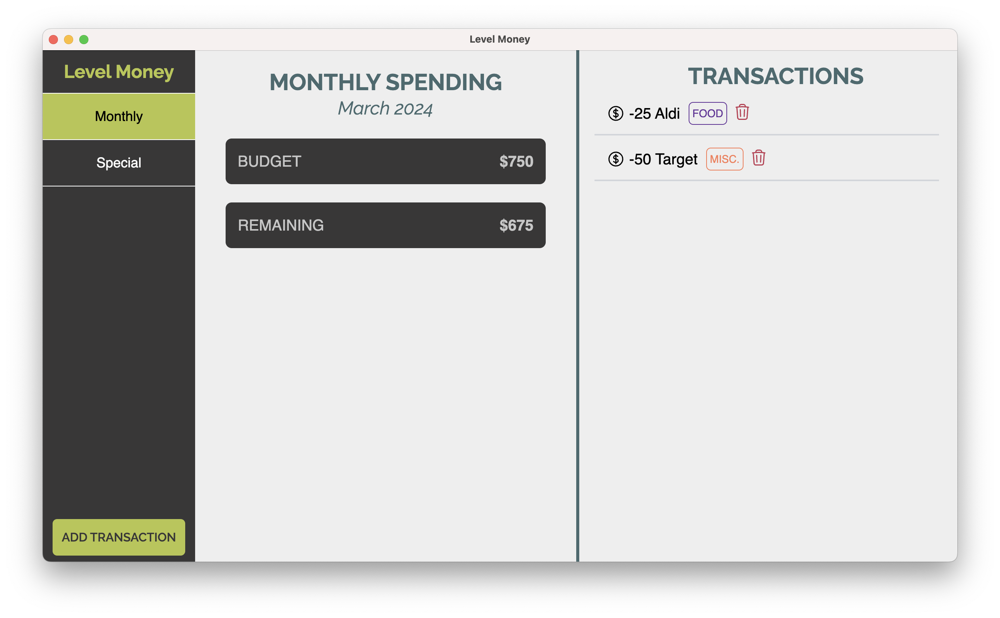

Level Money is a free application created in Electron, it helps track your expenses and keeps you in line with your goals and dreams.

### Why Level Money?

I wanted a money manager that just “worked” for me. Most money managers either have too many unuseful features or are too simplistic and not helpful. I designed Level Money to bridge this gap and be clear and helpful.

### The Functionality

This application is loosely based on Kakaibo, the Japanese way of saving money. This approach takes in your income minus any fixed expenses and money you want to save, then creates a spending goal based on these parameters for the month. This goal is then shown prominently in the monthly section and a separate section shows how much you have left to spend for the month. The idea is almost like a video game, to spend your money but near zero at any time in the month.

**NOTE:** This application is still in progress and not all features are ready yet. Currently, there are no ways in the application to create a spending income/special income, monthly expenses do not auto-clear, and other small tasks are not ready yet. Both features are noted for active development.

The other ledger in this application is called “Special”. You can think of “Special” as being for financial situations that are out of your control, such as large unplanned business/personal costs, medical or auto bills, or any other need that arises. This ledger has a larger per diem assigned to it at around $1,000 or more and resets quarterly (every three months). While this is not strictly a Kaikabo feature, it is one that I find is needed in most financial situations.

### The Technical Details

Level Money is built using Create React App and Electron. I decided on Create React App as it neatly fits within Electron as nothing needs to be statically rendered. For the financial data, the application uses a built-in database within Electron (IndexedDB) which was an intentional choice. Unfortunately, this method does mean that all your data lives “in app” and cannot be communicated externally to a phone or tablet, but it is more secure this way, as it cannot be tampered with externally.

Working with IndexedDB, I used the [Dexie.js](https://dexie.org/) library to interface with the application database. This is because the native interface is very confusing and difficult to use, there are a couple of other libraries out there (like one from [Jake Archibald](https://github.com/jakearchibald/idb)) for working with IndexedDB but Dexie was by far the fastest and simplest to get up and running in Electron and handled data better than any other method that I could find.

My plans for the future are to transfer all application components over to Typescript for code quality. Also, to better understand Electron’s API for a better application experience. There are still core features that need to be built first, so these are going to be a while before they are worked on.

### Conclusion

My goal and hope for Level Money is that will help bring financial peace of mind to people who typically don’t use financial applications. While many other applications do have fancier bells and whistles, Level Money aims to be simple to learn and master. It will hopefully to many how easy and fun it can be to both spend and save money.
