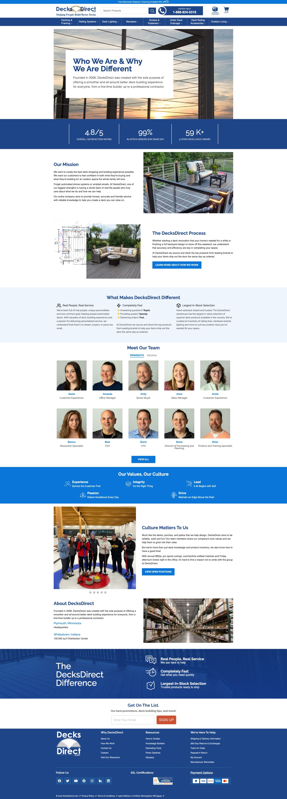
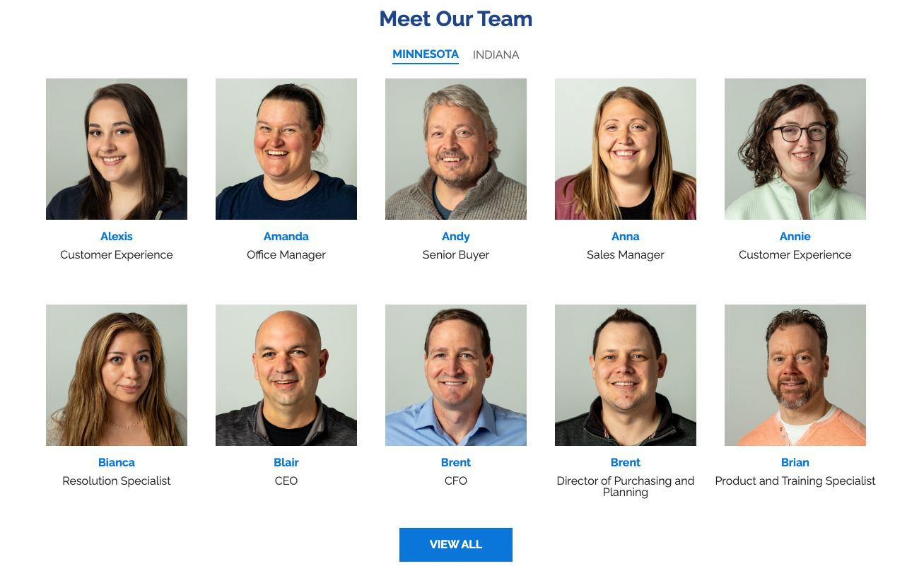
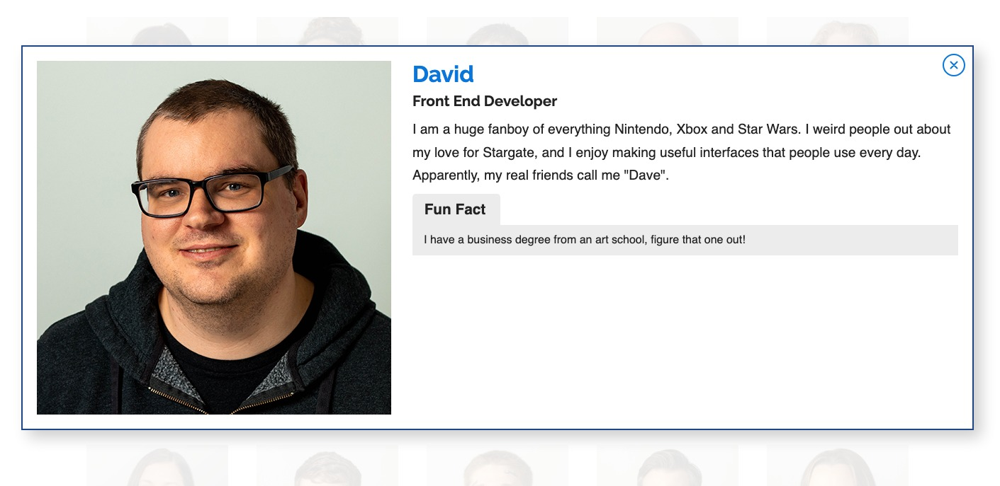

### Overview

When I started at [DecksDirect](https://www.decksdirect.com), one of the first things that the owner wanted me to do was to show off the company’s “Real People, Real Service” value. This was important to him as it showed our visitors that when you called the company, you were getting a real human being, not a robot.

### My Role and Responsibilities

My role in this project was vast, it ranged from collecting information from the employees, writing new company-wide rules on how that information was to be handled, and then finally developing the code needed to display this information on the page. This ended up being one of the most comprehensive projects that I have worked on, due to the vast range of work required of me.

### The Process

#### The Groundwork

This process started with the Creative Manager and me going through all the requirements and building out a timetable with all the steps needed for completion. Once we had a timetable in place, the next step was to create an SOP or Standard Operating Procedure which was a document that handled all cases for adding, editing, and deleting employee information to this webpage. This document was created with the intent that it was to be followed by everyone and was created in collaboration with Human Resources and other vital members of the DecksDirect team.

#### Content, Design, and Assets

Once the rules were approved, a form was created and emailed out to all employees. The photography was handled by the graphic designer who took and edited all employee photographs. When all the content and assets were collected, the Creative Manager had finished the design and it was ready for work.

#### Development

At this point in the process, I had roughly about two weeks left before the entire project was due. With this in mind, I compiled all the information and asset locations into a massive JSON document and stored it on the company's servers. I then built a custom module that parsed the large JSON file and mapped it into a grid using [Vue.js](https://vuejs.org/). Finally, with the development complete, all the documentation was uploaded and archived on the company's servers and the final approval by the owner was given.

### Conclusion

This was one of the most challenging yet rewarding projects that I have ever been a part of. It required collaboration with multiple departments, following strict guidelines and timetables, and finally a tight turnaround window to complete the final code. I did however learn quite a bit as it required me to step out of my comfort zone and learn skills that I normally did not use. It was a success for the employees, as it not only showed off their individual personalities but also the strength of the company. Finally, when customers called in, they could be comforted that there were real people on the other end of the line, not just digital robots.

Unfortunately, the code deployed for this project no longer exists, it has since been reduced to a simpler page for editing reasons. The same guidelines though are still in place and are still followed to this day.
