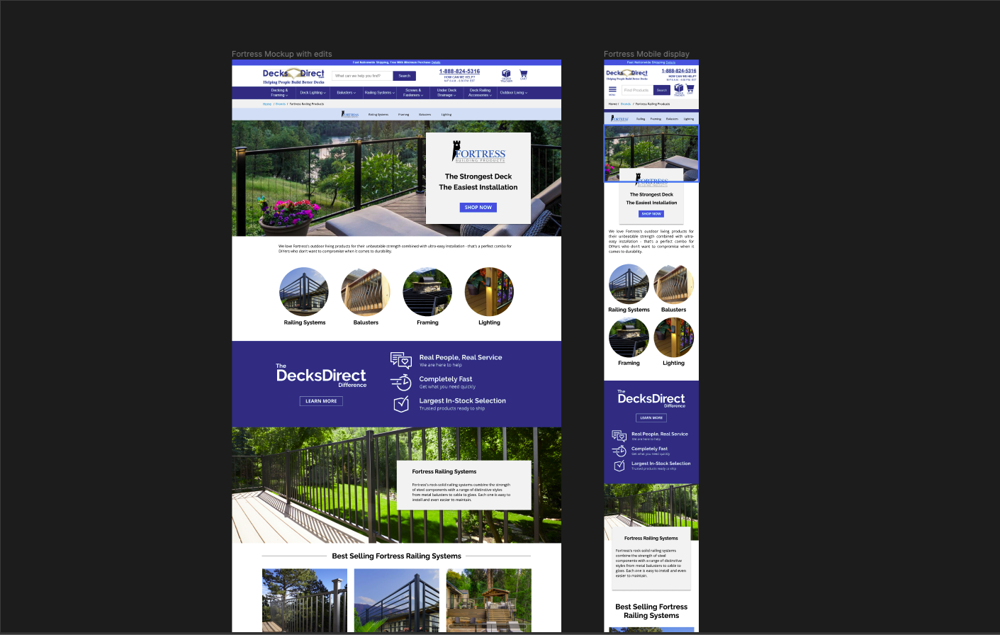
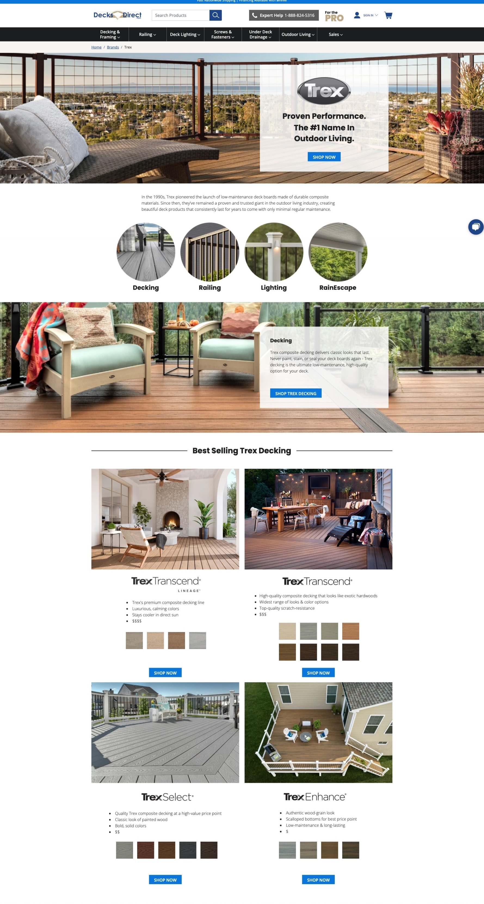
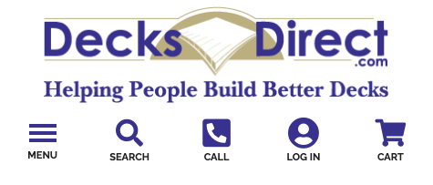

DecksDirect is an online distributor of premium decking products, they specialize in helping customers build their dream decks with expert advice and premium decking products. This job gave me the unique opportunity to work in many diverse roles with the ultimate goal of helping people build better decks.

#### Landing Pages

One of my main roles was to promote and sell products and services by creating custom-developed landing pages. I worked with both the graphic designer and content specialist to take their designs and translate them into code that lived on the website.

The frontend of DecksDirect utilizes the [Tailwind CSS](https://tailwindcss.com/) framework, this meant that all the styling was to be done using CSS class names instead of the typical style rules that you find in vanilla CSS. The main draw of using a framework like Tailwind is that all the classes are universal and recognizable, but the downside is that it can be opinionated, and I found myself still writing traditional CSS for certain declarations or properties.

Each page was decided by upper management based on what products or brands they needed to be promoted. Once a page was decided, it was given to the graphic designer and content specialist to come up with appropriate graphics and messaging for the page. Once the design was approved it was handed to me for asset extraction and development.

Once developed and approved for production, the landing page was sent to the website through a backend portal. This portal could be limiting at times, as it only allowed for certain coding elements to be displayed on the page, while Tailwind classes worked seamlessly through a plugin, other styling and elements could cause difficulty and at times needed to be tweaked using the portals editor.

Finally, because most of these pages used the same design patterns, I was able to develop my pattern library. This helped speed up development time and freed me up to focus on custom design patterns that needed to be implemented on certain pages.

Below is a sample of some of the pages that I worked on for DecksDirect, I have divided them into two categories: brand and promotional.

##### Brand Pages:

These are designed to promote a single brand; all of these pages use the same design patterns with different assets or layouts.

- [https://www.decksdirect.com/brands/keylink](https://www.decksdirect.com/brands/keylink)
- [https://www.decksdirect.com/brands/timbertech-by-azek-building-products](https://www.decksdirect.com/brands/timbertech-by-azek-building-products)
- [https://www.decksdirect.com/brands/trex](https://www.decksdirect.com/brands/trex)
- [https://www.decksdirect.com/brands/fortress](https://www.decksdirect.com/brands/fortress)
- [https://www.decksdirect.com/brands/feeney-cablerail](https://www.decksdirect.com/brands/feeney-cablerail)

##### Promotional Pages:

These highlight the experience and services you will receive when working with DecksDirect.

- [https://www.decksdirect.com/complete-deck-packages](https://www.decksdirect.com/complete-deck-packages)
- [https://www.decksdirect.com/free-project-planning](https://www.decksdirect.com/free-project-planning)
- [https://www.decksdirect.com/instant-patio-transformation](https://www.decksdirect.com/instant-patio-transformation)
- [https://www.decksdirect.com/deck-planning-guide](https://www.decksdirect.com/deck-planning-guide)
- [https://www.decksdirect.com/decksdirect-pro](https://www.decksdirect.com/decksdirect-pro)
- [https://www.decksdirect.com/composite-decking-buying-guide](https://www.decksdirect.com/composite-decking-buying-guide)

##### Website Realignment

One of my first roles was to realign the website to modern mobile practices. This included researching mobile design patterns and realigning the website to be more mobile-friendly. A couple of examples of this were creating a search box that was open by default on mobile devices and refining the navigation slide out to be easier to browse and close.

##### Bug Reporting

I was also responsible for receiving and investigating bug reports. These would normally come in through the company’s bug-tracking platform. My role, once a ticket was received, would be to go through and try to recreate the bug on the website. If I could not recreate the bug or fix it, I would work with others to either understand the bug more comprehensively or delegate the ticket to others to be resolved.

##### Project Replatforming

Finally, there was once an opportunity to re-platform the company’s blog (called [Knowledge Builders](https://www.decksdirect.com/knowledge-builders)) to a better authoring platform such as WordPress. While ultimately this opportunity did not happen, my role was to advocate for the new platform and create a simple path for transitioning content and design. These tasks included: research and presentation on why to use the platform, which included reasons like not having all content on one platform, improved reading experience, and better authoring tools. My other task included preliminary post migration and initial site development which was eventually scrapped for other projects.

#### Conclusion

While I had fun at DecksDirect, I was also confronted with a diverse and challenging array of tasks. While some of these tasks were fun and exciting, others were challenging and pushed me outside of my comfort zone. My main takeaways from this job are how working with the right people can make even the most difficult projects doable and always listening to the customer is the right move, their feedback can help move you in directions you could never find out on your own.
