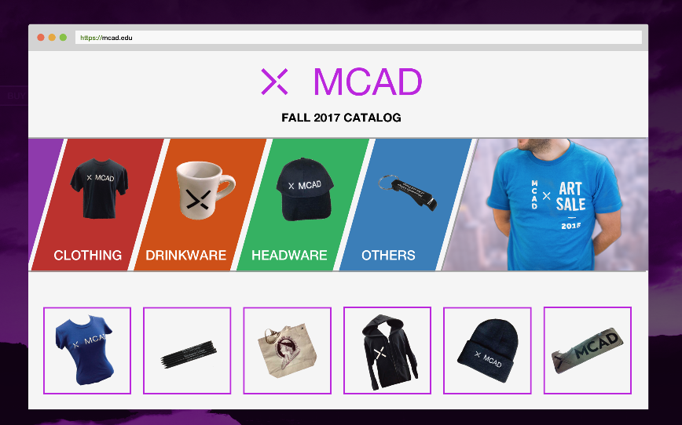
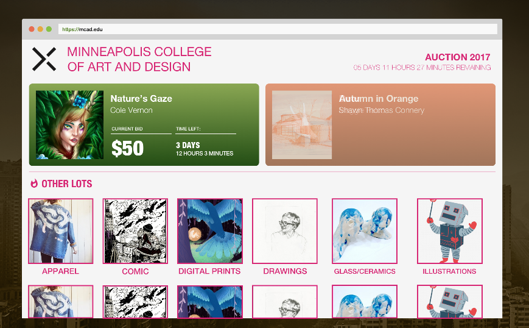
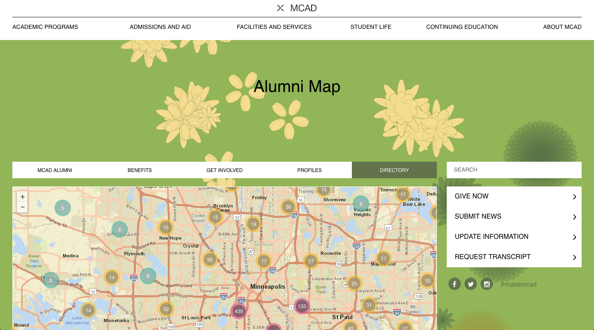

## Overview

Minneapolis College of Art and Design (MCAD) is a renown art college based in Minnesota. Since 1886, it has taught students from all around the world.  MCAD's degrees fall in fine arts, design, entrepreneurship, and sustainability education.

### Project Overview

As I was finishing my degree at MCAD, I was fortunate to work with the college in their web department. A few of the things I was responsible for were:

- Building lists with present data that reloads
- Develop shopping cart and eCommerce solutions to upcoming projects
- Using Drupal to locate users and present their location with map data
- A clock that could output hour data from simple inputs

## Persistent lists

<iframe height='365' scrolling='no' title='Persistent checkboxes' src='//codepen.io/davidholbrook/embed/preview/dzdypb/?height=365&theme-id=dark&default-tab=result&embed-version=2' frameborder='no' allowtransparency='true' allowfullscreen='true' style='width: 100%;'>See the Pen <a href='https://codepen.io/davidholbrook/pen/dzdypb/'>Persistent checkboxes</a> by davidholbrook (<a href='https://codepen.io/davidholbrook'>@davidholbrook</a>) on <a href='https://codepen.io'>CodePen</a>.
</iframe>

One of the projects was to create an unordered checklist that would keep it's checked on or off state. This state would remain true if the user closed the browser window and came back at a different time as well.

This problem was challenging as the checkbox could not be tied to an account or user id. Also, due to European regulations, we could not use cookies or any other 'trackers' to watch the checked off items. Because of this, I ended up using the local storage API to solve this problem.

### Web API

To solve this problem, I used the [localStorage API](https://developer.mozilla.org/en-US/docs/Web/API/Window/localStorage) to first check and see if any 'keys' have been set. If no 'keys' have been set it would then wait for the save button to be clicked and then set the state to a key/value pair.

This project was more a proof of concept and the code can be found on [Codepen](https://codepen.io/davidholbrook/pen/dzdypb).

## E-Commerce Solutions

Another project I was tasked with in the school was to do some research and come up with a proof of concept for an online auction. The online auction is a large event that happens every year at MCAD. They have in the past used outside services to host this event. Although, due to a desire to be more cohesive, they tasked me with researching how this could be used internally.

### A Two-Sided Store

One of the first things that we had discussed was creating a two-sided store. One side would be for alumni and students to buy [school supplies](http://share.framerjs.com/0b7mujh3ed3c/) and the other for [special events](http://share.framerjs.com/22vdysq84h59/). After this, I started looking at how other schools in the association did art sales. I found some specific strengths within MCAD, one of which is their fantastic art sale each year. Because of this, I built a compositional prototype for the school. This prototype showed the school could sell products, using categorization and featured sections.

This prototype is being used by the school for future consideration.

## A Map of Alumni

The cornerstone project of my time at MCAD would be the [Alumni map](http://mcad.edu/alumni/directory/). The Alumni map is a world map which showcases the location of alumni all across the world. My task on this project was researching and initial development of the map.

### Leaflet Maps

This project took about three months from start to finish and was built using Drupal and Leaflet Maps. The most significant challenge was bringing in location data and having it be pinned on a map. For this challenged, I used over 20 different services until I found on that worked within Drupal. Using this service, I was able to hook the location data into Leaflet using a custom view, which outputs a map. This project was a success and can be publicly viewed on the [MCAD website](http://mcad.edu/alumni/directory/).
