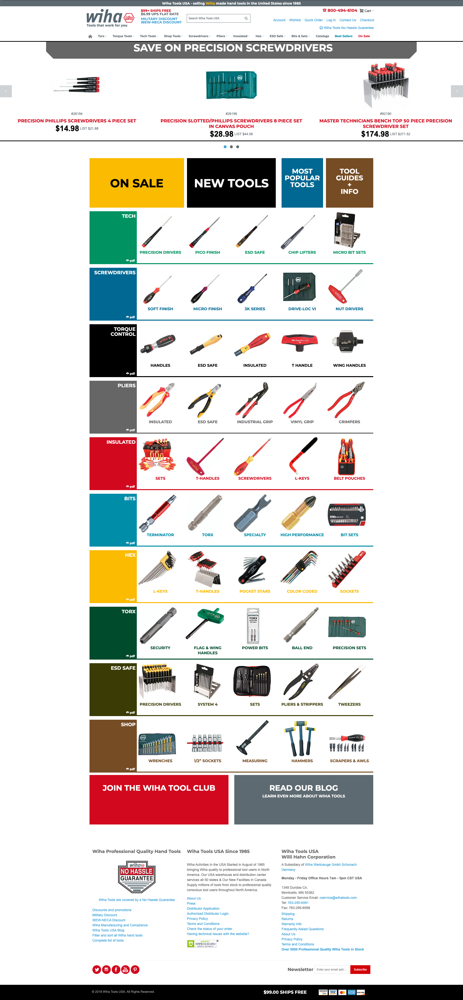

## Overview

[Wihatools.com](https://wihatools.com) is the e-commerce heart of Wiha Tools USA. Wiha Tools USA sells premium quality German hand tools to the American markets (USA, Canada, and South America). With a strong base of 64,000 users each month, the store brings in about 10% of the company's million dollar plus annual income.

## My roles and responsibilities

I was brought into the team in 2019 with the main responsibility of upgrading and re-design their online store from the current version of Magento 1 to the newer version 2. This upgrade was primarily needed due to security issues around the depreciation of the current version as well the new opportunities the could be provided for version 2.

I was also responsible for creating and updating many internal tooling for customer service and operations. This included generating UPC codes, generating multiple reports and updating inventory. My primary focus remained working on the storefronts though.

## Problems and Opportunities

Working on digital storefronts brings with it a different set of problems from most other kinds of websites. On the plus side, selling physical goods are much simpler and easier to develop for as as it doesn’t require maintaining long lasting digital services and security to the customer. Although, on the other hand, even on the best storefronts accessibility, performance and bloat always remain a present challenge.

Working for a small company provided many opportunities for me to design and develop outside of my comfort zone. I would many times come with ideas or suggestions and get the green light to incorporate them into the website in some way or form. This also meant that working with a two person team, many ideas or possibilities were simply too large and could not be developed with the resources on hand.

## Store Development

Working with open source software, such as Magento, is always a bit tricky as it is not always thoroughly tested and not fully featured. There would be many times where I would be forced to develop a module to extend some core functionality that was a few steps away from being perfect for our needs. Because of this I developed multiple modules (or plugins) for our store. These modules handled everything from displaying sku numbers on the category pages of a product, to running full inventory reports for our other storefronts and payment gateways such as Amazon and Klarna.

Other problems I would run into would be related to security and reliability of the online store. Wiha Tools is completely self-hosted and secured by Amazon Web Services (AWS). Because of this we were able to completely oversee and own our store from beginning to end. We also ran into many problems as well (especially in the early days of deployment) with the server needing to be restarted manually (many times in the middle of the night) and staying constant with security and technology updates. In the end it helped us remain on top of our competitors as we were able to bring new requested features and ideas to our store than that of our competitors.

## Feedback

The final component of the redesign and upgrade was to listen. Customer feedback and voices are extremely important to the success of Wiha Tools and I was constantly listening to feedback, both from customer service and leadership. Because the company has a very active and vocal fan base, I would keep every piece of customer feedback that was emailed to me and try to find ways to incorporate it into the store. This included making a feature on the checkout easier to understand, or redesign a component on a product page for a more consistent browsing experience. Every voice was important to me as well as the company to remain on the top and to innovate in many key areas in the hand tool market.

## Conclusion

There is a lot that goes into a full website redesign, and even more that goes into an upgrade of an online store. Throughout this whole experience I learn many valuable lessons and experiences that helped me to grow into a better and stronger developer. I also learned the importance of listening to the customer and people around you as it sometimes takes the people who are using the website and people working with the website to help create something that is truly unique and special for everyone to use.
